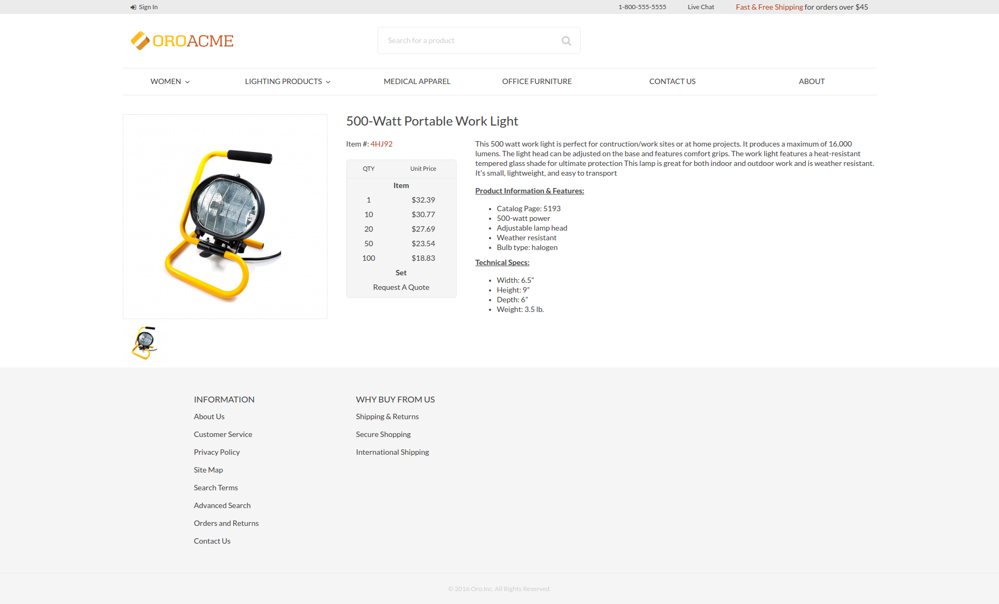
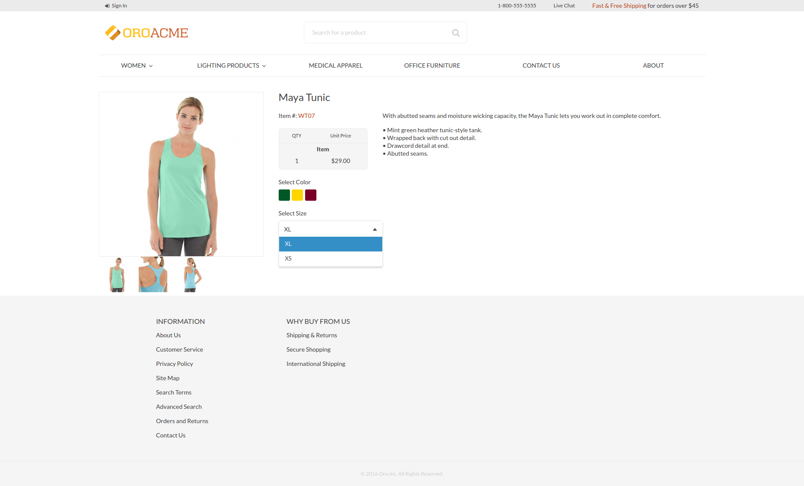

Customize Product View Page
=============================

In this example we consider how to customize product with different product types:

- [Simple Product](#simple-product)
- [Configurable Product](#configurable-product)

### Getting started

Every product view page contains current **product_type** in layout context.
So you can use it in the your layout update **conditions**. When you customize any page don't forget to use **Symfony Profiler** and look into **Layout** section.
You can find there current layout **context** data and actual layout **tree**. Please see [Debug Information](https://github.com/orocrm/platform/tree/master/src/Oro/Bundle/LayoutBundle/Resources/doc/debug_information.md) for more details.

First of all we need to create **import** that will be used in **Simple Product** and **Configurable Product**.

```yml
# src/Acme/Bundle/ProductBundle/Resources/views/layouts/default/imports/oro_product_view/layout.yml

layout:
    actions:
        - '@setBlockTheme':
            themes: 'layout.html.twig'

        - '@addTree':
            items:
                product_view_page:
                    blockType: container
                product_container:
                    blockType: product_view_container
                    options:
                        product: '=data["product"]'
                product_title_mobile:
                    blockType: text
                    options:
                        text: '=data["locale"].getLocalizedValue(data["product"].getNames())'
                product_image:
                    blockType: product_image
                    options:
                        product: '=data["product"]'
                product_description_container:
                    blockType: container
                product_title_container:
                    blockType: container
                product_specification_container:
                    blockType: container
                product_specification:
                    blockType: container
                product_specification_sku:
                    blockType: text
                    options:
                        text: '=data["product"].getSku()'
                product_description_content:
                    blockType: container
                product_description:
                    blockType: text
                    options:
                        text: '=data["locale"].getLocalizedValue(data["product"].getDescriptions())'
                        escape: false
            tree:
                page_content:
                    product_view_page:
                        product_container:
                            product_image: ~
                            product_description_container:
                                product_title_container: ~
                                product_specification_container:
                                    product_specification:
                                        product_specification_sku: ~
                                product_description_content:
                                    product_description: ~

        - '@setOption':
            id: title
            optionName: params
            optionValue:
                '%name%': '=data["locale"].getLocalizedValue(data["product"].getNames())'

        - '@setOption':
            id: page_title
            optionName: text
            optionValue: '=data["locale"].getLocalizedValue(data["product"].getNames())'

        - '@move':
            id: page_title
            parentId: product_title_container
```

and template:

```html.twig
{# src/Acme/Bundle/ProductBundle/Resources/views/layouts/default/imports/oro_product_view/layout.html.twig #}


    

    <div {{ block('block_attributes') }}>
        {{ block_widget(block) }}
    </div>



    <h3 class="product-title">{{ text }}</h3>



    

    <div class="product-gallery-widget product-gallery-widget_vertical product-gallery-widget_l_floated">
        <div class="product-gallery product-gallery_vertical">
            <div class="product-gallery__image-holder">
                <div class="product-gallery__image-holder__carousel" data-product-gallery>
                    <div class="product-gallery__image-holder__container">
                        
                        
                    </div>
                    
                        
                    
                </div>
            </div>
        </div>
    </div>



    <div class="product__description-container">
        {{ block_widget(block) }}
    </div>



    

    <div {{ block('block_attributes') }}>
        {{ block_widget(block) }}
    </div>



    <div class="product__specification-container product__specification-container_l_floated">
        {{ block_widget(block) }}
    </div>



    <div class="product__specification">
        {{ block_widget(block) }}
    </div>



    <div>
        {{ 'oro.product.frontend.index.item'|trans }} <span class="red">{{ block_widget(block) }}</span>
    </div>



    <div class="product__description-content product__description-content_l_floated">
        <div class="product__description">
            {{ block_widget(block) }}
        </div>
    </div>

```

### Simple product

In our case simple product inherit all import properties. Create layout update that include **oro_product_view** import and has **conditions** to check if the current product has **simple** product type.
Our simple product look like this:



```yml
# src/Acme/Bundle/ProductBundle/Resources/views/layouts/default/oro_product_frontend_product_view/simple_product.yml

layout:
    imports:
        - oro_product_view

    actions: []

    conditions: 'context["product_type"] == "simple"'
```

### Configurable product

Create layout update that include **oro_product_view** import and has **conditions** to check if the current product has **configurable** product type.
Add **product variants** block.
Our configurable product look like this:


```yml
# src/Acme/Bundle/ProductBundle/Resources/views/layouts/default/oro_product_frontend_product_view/configurable_product.yml

layout:
    imports:
        - oro_product_view

    actions:
        - '@setBlockTheme':
            themes: 'configurable_product.html.twig'

        - '@add':
            id: product_variants
            blockType: product_variants
            parentId: product_specification_container
            siblingId: product_specification
            options:
                variants: '=data["product_variants"].getVariants(data["product"])'

    conditions: 'context["product_type"] == "configurable"'
```

template:

```html.twig
{# src/Acme/Bundle/ProductBundle/Resources/views/layouts/default/oro_product_frontend_product_view/configurable_product.html.twig #}


    
        
        <div class="product__{{ key }}s">
            <label for="product_variants_{{ key }}">Select {{ variant.name }}</label>

            
                
                    <span class="badge badge_sm product__colors__item color-item_{{ key }}">
                        <input type="checkbox" name="{{ key }}" alt="{{ name }}" />
                    </span>
                
            
                <select id="product_variants_{{ key }}" class="select select--size-s">
                    
                        <option value="{{ key }}">{{ name }}</option>
                    
                </select>
            
        </div>
    

```

#### Block types

For this example we need to create **product_variants** block type that used in **configurable product** layout update.

```yml
# src/Acme/Bundle/ProductBundle/Resources/config/block_types.yml

services:
...
    acme_product.layout.type.product_variants:
        parent: oro_layout.block_type.abstract_configurable_container
        calls:
            - [setOptionsConfig, [{variants: {required: true}}]]
            - [setName, ['product_variants']]
        tags:
             - { name: layout.block_type, alias: product_variants }
...
```

#### Data providers

Also we need to create **product_variants** data provider that used in **configurable product** layout update.

```yml
# src/Acme/Bundle/ProductBundle/Resources/config/services.yml

services:
...
    acme_product.layout.data_provider.product_variants:
        class: 'Acme\Bundle\ProductBundle\Layout\DataProvider\ProductVariantsProvider'
        tags:
            - { name: layout.data_provider, alias: product_variants }
...
```

example of data provider:

```php
<?php
// src/Acme/Bundle/ProductBundle/Layout/DataProvider/ProductVariantsProvider.php

namespace Acme\Bundle\ProductBundle\Layout\DataProvider;

use Symfony\Component\PropertyAccess\PropertyAccess;

use Oro\Bundle\EntityExtendBundle\Entity\AbstractEnumValue;
use Oro\Bundle\ProductBundle\Entity\Product;

class ProductVariantsProvider
{
    /**
     * @param Product $product
     *
     * @return array
     */
    public function getVariants(Product $product)
    {
        $variants = [];
        $variantFields = $product->getVariantFields();
        foreach ($variantFields as $variantField) {
            $variants[strtolower($variantField)]['name'] = $variantField;
        }

        $propertyAccessor = PropertyAccess::createPropertyAccessor();

        $variantLinks = $product->getVariantLinks();
        foreach ($variantLinks as $variantLink) {
            $childProduct = $variantLink->getProduct();
            foreach ($variants as $key => $variant) {
                /** @var AbstractEnumValue $enumValue */
                $enumValue = $propertyAccessor->getValue($childProduct, $key);
                $variants[$key]['elements'][$enumValue->getId()] = $enumValue->getName();
            }
        }

        return $variants;
    }
}
```

### Product Family

#### Attribute Set (example 1)

@TODO

#### Attribute Set (example 2)

@TODO

#### Attribute Groups

@TODO
