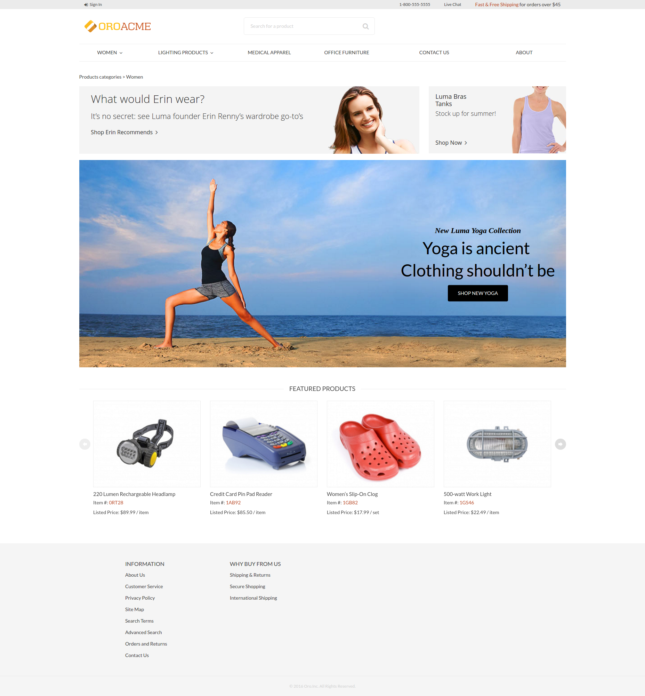
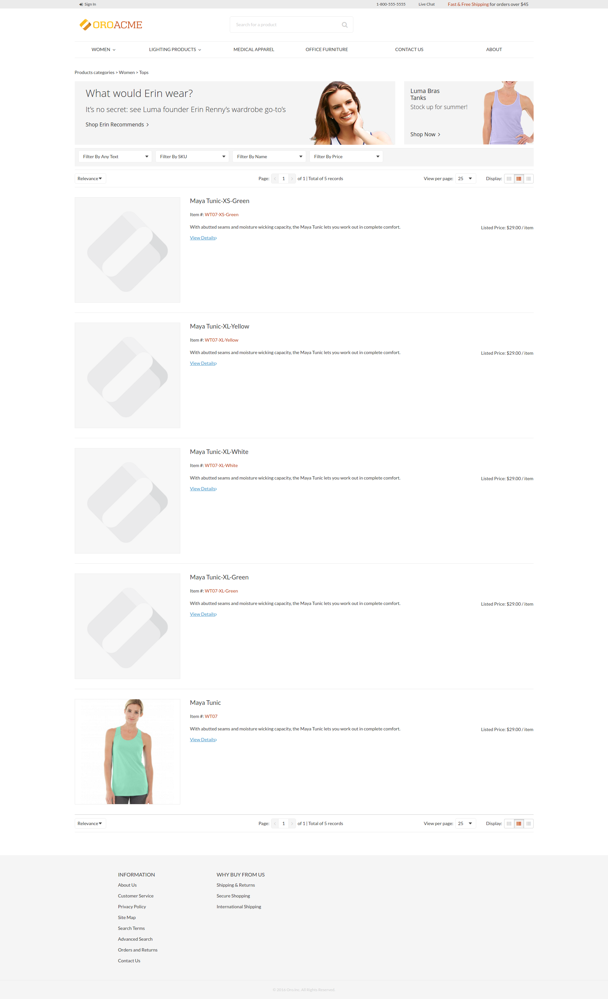
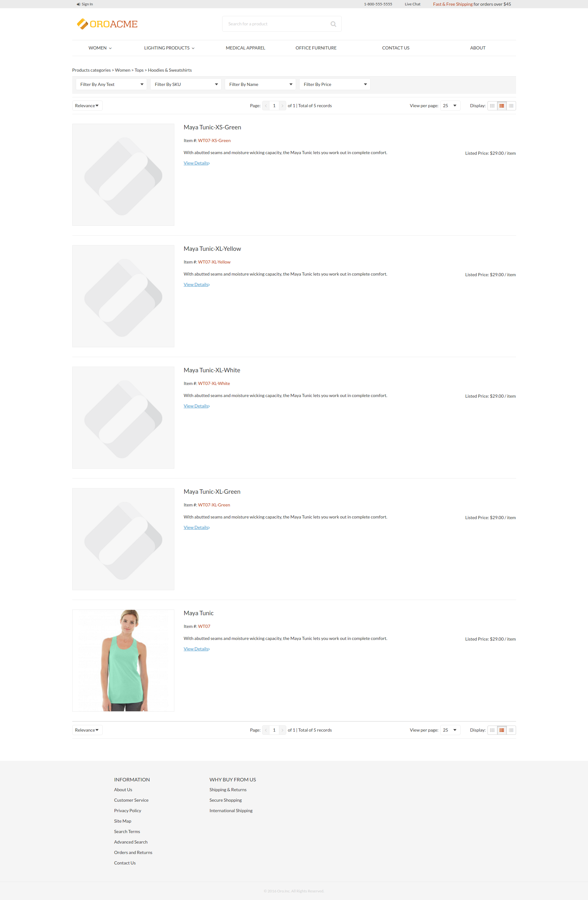

Customize Product List Page
=============================

In this example we consider how to customize product list page with 3 different cases:

- [Static Block only](#static-block-only)
- [Static Block and Products](#static-block-and-products)
- [Products only](#products-only)

### Getting started

Every product list page contains current **category_id** in layout context.
So you can use it in the your layout update **conditions**. When you customize any page don't forget to use **Symfony Profiler** and look into **Layout** section.
You can find there current layout **context** data and actual layout **tree**. Please see [Debug Information](https://github.com/orocrm/platform/tree/master/src/Oro/Bundle/LayoutBundle/Resources/doc/debug_information.md) for more details.

### Static Block only

In the first case let's create a first level category (with **id = 8**) that contains static block only and page is look like this:


First of all we need to create layout update:

```yml
# src/Acme/Bundle/ProductBundle/Resources/views/layouts/default/oro_product_frontend_product_index/static_block_only.yml

layout:
    imports:
        -
            id: oro_product_list
            root: featured_products_container
            namespace: featured

    actions:
        - '@setBlockTheme':
            themes: 'static_block.html.twig'

        - '@addTree':
            items:
                product_index_page:
                    blockType: container
                product_search_navigation:
                    blockType: container
                embedded_example_1:
                    blockType: block
            tree:
                page_content:
                    product_index_page:
                        product_search_navigation: ~
                        embedded_example_1: ~

        - '@setOption':
            id: featured_products
            optionName: items
            optionValue: '=data["featured_products"].getAll()'

        - '@setOption':
            id: featured_products
            optionName: label
            optionValue: oro.product.featured_products.label

        - '@setOption':
            id: featured_products
            optionName: slider_options
            optionValue: {arrows: true, responsive: [{breakpoint: 1100, settings: {arrows: false}}, {breakpoint: 924, settings: {slidesToShow: 3, arrows: false}}, {breakpoint: 480, settings: {slidesToShow: 2, arrows: false}}]}

        - '@setOption':
            id: featured_product_line_item_form
            optionName: instance_name
            optionValue: featured_products

        - '@add':
            id: featured_products_container
            parentId: product_index_page
            blockType: container

    conditions: 'context["category_id"] in [8]' # affected categories 
```

and template:

```html.twig
{# src/Acme/Bundle/ProductBundle/Resources/views/layouts/default/oro_product_frontend_product_index/static_block.html.twig #}


    <div>
        {{ block_widget(block) }}
    </div>
    <br>



    
    {{ block_widget(block, {attr: attr}) }}



    
    {{ block_widget(block, {attr: attr}) }}



    <div class="embedded-list">
        <div class="embedded-list__container">
            <div class=" hero-promo-item">
                <a href="#" style="float: left;">
                    <div class="hero-promo-item__picture">
                        
                    </div>
                </a>

                <a href="#" style="float: right;">
                    <div class="hero-promo-item__picture">
                        
                    </div>
                </a>

                <div style="clear: both;"></div>
            </div>

            <br>

            <div class=" hero-promo-item">
                <a href="#">
                    <div class="hero-promo-item__picture">
                        
                    </div>
                </a>

                <div class="hero-promo-item__info">
                    <div class="hero-promo-item__cover">
                        <div class="hero-promo-item__desc">
                            <a href="#" tabindex="-1">
                                <span class="hero-promo-item__pretitle">New Luma Yoga Collection</span>
                                <h2 class="hero-promo-item__title">Yoga is ancient <br/> Clothing shouldn’t be</h2>
                            </a>
                            <a href="#" class="btn theme-btn btn-dark hero-promo-item__view-btn">
                                Shop New Yoga
                            </a>
                        </div>
                    </div>
                </div>
            </div>
        </div>
    </div>

```

### Static Block and Products

In the second case let's create a second level category (with **id = 9**) that contains static block and product. Page is look like this:


So we need to create layout update:

```yml
# src/Acme/Bundle/ProductBundle/Resources/views/layouts/default/oro_product_frontend_product_index/static_block_and_products.yml

layout:
    imports:
        - oro_product_grid

    actions:
        - '@setBlockTheme':
            themes:
                - 'products.html.twig'
                - 'static_block.html.twig'

        - '@addTree':
            items:
                product_index_page:
                    blockType: container
                product_search_navigation:
                    blockType: container
                embedded_example_2:
                    blockType: block
                product_grid_container:
                    blockType: container
            tree:
                page_content:
                    product_index_page:
                        product_search_navigation: ~
                        embedded_example_2: ~
                        product_grid_container: ~

    conditions: 'context["category_id"] in [9]' # affected categories
```

and extend static block template with our block:

```html.twig
{# src/Acme/Bundle/ProductBundle/Resources/views/layouts/default/oro_product_frontend_product_index/static_block.html.twig #}

...


    <div class="embedded-list">
        <div class="embedded-list__container">
            <div class=" hero-promo-item">
                <a href="#" style="float: left;">
                    <div class="hero-promo-item__picture">
                        
                    </div>
                </a>

                <a href="#" style="float: right;">
                    <div class="hero-promo-item__picture">
                        
                    </div>
                </a>

                <div style="clear: both;"></div>
            </div>
        </div>
    </div>


...
```

### Products only

In the third case create a third level category (all **ids** that **not equal 8 or 9**) that contains static block and product. Page look like this:


Create layout update:

```yml
# src/Acme/Bundle/ProductBundle/Resources/views/layouts/default/oro_product_frontend_product_index/products_only.yml

layout:
    imports:
        - oro_product_grid

    actions:
        - '@setBlockTheme':
            themes: 'products.html.twig'
        - '@addTree':
            items:
                product_index_page:
                    blockType: container
                product_search_navigation:
                    blockType: container
                product_grid_container:
                    blockType: container
            tree:
                page_content:
                    product_index_page:
                        product_search_navigation: ~
                        product_grid_container: ~

    conditions: 'context["category_id"] not in [8, 9]' # affected categories 
```

and template:

```html.twig
{# src/Acme/Bundle/ProductBundle/Resources/views/layouts/default/oro_product_frontend_product_index/products.html.twig #}


    

    <div {{ block('block_attributes') }}>
        {{ block_widget(block) }}
    </div>



    <div class="catalog-navigation-bar" data-page-component-module="oroproduct/js/app/components/breadcrumbs-navigation-block">
        <span class="path-info">
            {{ block('container_widget') }}
        </span>
        <span class="filters-info"></span>
    </div>

```
